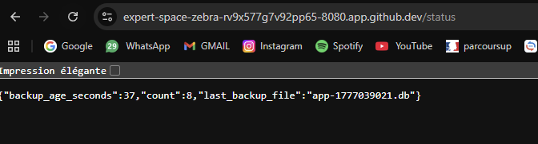
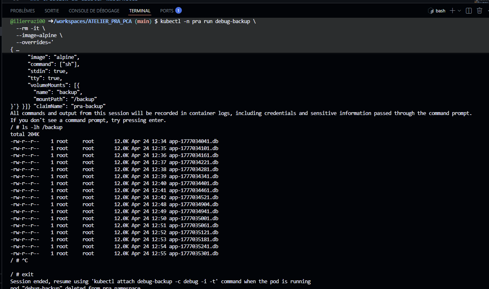
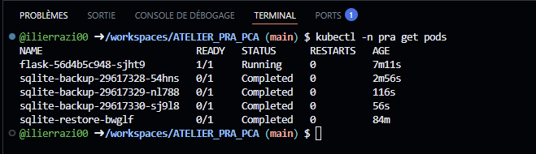
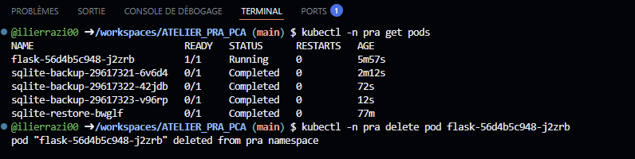
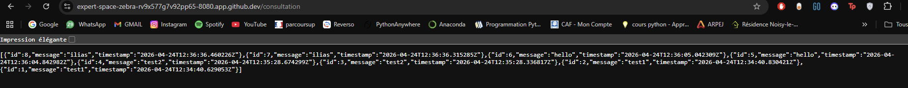

# ATELIER PRA / PCA – Kubernetes, Packer, Ansible


## Objectif

Cet atelier a pour objectif de mettre en œuvre un mini Plan de Continuité d’Activité (PCA) et Plan de Reprise d’Activité (PRA) en utilisant Kubernetes.

Nous avons réalisé les actions suivantes :

- Création d’une image Docker avec Packer  
- Déploiement automatisé avec Ansible  
- Utilisation de Kubernetes pour orchestrer l’application  
- Mise en place de volumes persistants (PVC)  
- Automatisation des sauvegardes avec un CronJob  
- Simulation de scénarios de crash (PCA et PRA)  

---

##  Architecture

L’architecture repose sur les composants suivants :

- Une application Flask déployée dans un Pod Kubernetes  
- Une base de données SQLite stockée dans un volume persistant `pra-data`  
- Un second volume `pra-backup` pour stocker les sauvegardes  
- Un CronJob Kubernetes exécuté toutes les minutes pour sauvegarder la base  
- Un cluster Kubernetes (k3d) avec 1 master et 2 workers  

### 📸 Architecture de la solution


👉 Ce schéma illustre l’organisation de l’application :
- Pod Flask connecté à un volume persistant
- Système de sauvegarde via CronJob
- Séparation entre données de production et backups

👉 Il met en évidence la logique PRA/PCA du système.
---

## Mise en place de l’environnement

### Création du cluster Kubernetes

``` bash
curl -s https://raw.githubusercontent.com/k3d-io/k3d/main/install.sh | bash

k3d cluster create pra \
  --servers 1 \
  --agents 2

kubectl get nodes
```

Installation de Packer
``` bash
PACKER_VERSION=1.11.2

curl -fsSL -o packer.zip \
"https://releases.hashicorp.com/packer/${PACKER_VERSION}/packer_${PACKER_VERSION}_linux_amd64.zip"

unzip packer.zip
sudo mv packer /usr/local/bin/
rm packer.zip

packer version
```

Installation d’Ansible
``` bash
pip install ansible
export PATH="$HOME/.local/bin:$PATH"

ansible-galaxy collection install kubernetes.core
```

Création de l’image Docker avec Packer
``` bash
packer init .
packer build -var "image_tag=1.0" .
```

Vérification :
``` bash
docker images | head
```

Import de l’image dans Kubernetes
``` bash
k3d image import pra/flask-sqlite:1.0 -c pra
```

Déploiement avec Ansible
``` bash
ansible-playbook ansible/playbook.yml
```

## Accès à l’application

```bash
kubectl -n pra port-forward svc/flask 8080:80
```

Puis ouvrir le port 8080 dans l’onglet PORTS du Codespace.

## Tests de l’application

Routes disponibles :

- `/` → affiche "Bonjour tout le monde !"
- `/add?message=test` → ajouter un message
- `/count` → nombre de messages
- `/consultation` → afficher les messages

## Vérification de la route /status (Atelier 1)



👉 Cette route retourne :
- Le nombre d’événements en base (`count`)
- Le dernier fichier de sauvegarde (`last_backup_file`)
- L’âge du dernier backup (`backup_age_seconds`)

👉 On vérifie que :
- Les données sont bien stockées
- Les sauvegardes sont accessibles depuis l’application
- Le système PRA fonctionne correctement

## Vérification des sauvegardes
```bash
  kubectl -n pra run debug-backup \
  --rm -it \
  --image=alpine \
  --overrides='{
    "spec": {
      "containers": [{
        "name": "debug",
        "image": "alpine",
        "command": ["sh"],
        "stdin": true,
        "tty": true,
        "volumeMounts": [{
          "name": "backup",
          "mountPath": "/backup"
        }]
      }],
      "volumes": [{
        "name": "backup",
        "persistentVolumeClaim": {
          "claimName": "pra-backup"
        }
      }]
    }
  }'
```

Puis :
```bash
ls -lh /backup
```

### 📸 Preuve des sauvegardes



👉 On observe plusieurs fichiers `.db`, ce qui prouve que les sauvegardes sont réalisées automatiquement chaque minute par le CronJob Kubernetes.

### 📸 État global du cluster Kubernetes



👉 Cette capture montre l’état des pods dans le namespace `pra`.

On observe :
- Le pod Flask en état `Running`
- Les jobs de sauvegarde `sqlite-backup` exécutés régulièrement
- Le job de restauration `sqlite-restore` en état `Completed`

👉 Cela confirme que :
- L’application fonctionne correctement
- Les sauvegardes sont bien automatisées
- Le processus de restauration PRA a été exécuté avec succès

## Scénario 1 – PCA (Crash du Pod)
```bash
kubectl -n pra get pods
kubectl -n pra delete pod <nom-du-pod>
```
### 📸 Preuve PCA (recréation automatique du pod)



👉 On observe que le pod initial (flask-56d4b5c948-j2zrb) est supprimé,
puis remplacé automatiquement par un nouveau pod (flask-56d4b5c948-sjht9).

👉 Cela montre que Kubernetes recrée automatiquement le pod sans intervention.

👉 Aucun impact sur les données → continuité de service assurée → PCA

### Résultat :
Le pod est automatiquement recréé
Les données sont conservées

Kubernetes assure la continuité de service → PCA

👉 Aucun impact sur le service → continuité assurée automatiquement 

## Scénario 2 – PRA (Perte des données)
Simulation du sinistre
```bash
kubectl -n pra scale deployment flask --replicas=0
kubectl -n pra patch cronjob sqlite-backup -p '{"spec":{"suspend":true}}'
kubectl -n pra delete job --all
kubectl -n pra delete pvc pra-data
```

### 📸 Preuve PRA (restauration des données)



👉 Après suppression du volume `pra-data` et restauration via le job Kubernetes,
les données sont récupérées depuis les sauvegardes.

👉 On observe que les anciens messages sont bien présents,
ce qui confirme que la restauration fonctionne correctement.

👉 Contrairement au PCA, une intervention manuelle est nécessaire :
cela correspond à un PRA.

### Résultat :
La base de données est supprimée
L’application ne fonctionne plus

👉 Intervention manuelle nécessaire → reprise après sinistre (PRA)

Restauration
```bash
kubectl apply -f k8s/
kubectl apply -f pra/50-job-restore.yaml
```

Puis :
```bash
kubectl -n pra port-forward svc/flask 8080:80
```
Les données sont restaurées depuis les backups.

## Exercices 
### Exercice 1

Les composants critiques sont :

Le PVC pra-data
La base SQLite

👉 Leur perte entraîne une perte de données.

### Exercice 2

Les données n’ont pas été perdues car :

Elles étaient sauvegardées dans pra-backup
Une restauration est possible
### Exercice 3
RTO : quelques minutes
RPO : 1 minute
### Exercice 4

Non adapté à la production car :

- Absence de réplication des données
- Stockage local uniquement
- Pas de haute disponibilité (HA)
- Pas de sauvegarde externalisée (cloud)
### Exercice 5

Solution améliorée :

Stockage distribué (S3 / MinIO)
Réplication multi-nodes
Multi-cluster
Monitoring + alerting


## Runbook PRA (procédure de restauration)

En cas de perte de la base de données (`pra-data`), voici la procédure à suivre :

1. Arrêter l’application :
```bash
kubectl -n pra scale deployment flask --replicas=0
```
2. Suspendre les sauvegardes :
```bash
kubectl -n pra patch cronjob sqlite-backup -p '{"spec":{"suspend":true}}'
```
3. Supprimer la base de données :

```bash
kubectl -n pra delete pvc pra-data
```
4. Recréer l’infrastructure :
```bash
kubectl apply -f k8s/
```
5. Restaurer la base depuis le backup :

```bash
kubectl apply -f pra/50-job-restore.yaml
```
6. Redémarrer l’application :

```bash
kubectl -n pra port-forward svc/flask 8080:80
```

👉 Cette procédure permet de restaurer les données à partir du dernier backup disponible.

---

## Atelier 2 – Choix du point de restauration

Actuellement, la restauration utilise automatiquement le dernier backup disponible.

Pour améliorer le PRA, nous proposons de restaurer un backup spécifique.

### Procédure :

1. Lister les backups disponibles :

```bash
ls /backup
```

2. Identifier le fichier souhaité (ex: backup-2026-04-24-13-00.db)
3. Adapter le job de restauration pour utiliser ce fichier spécifique.
4. Lancer la restauration :
```bash
kubectl apply -f pra/50-job-restore.yaml
```
👉 Cette amélioration permet :

- de revenir à un point précis dans le temps  
- de limiter les pertes de données  
- d’avoir un PRA plus flexible  

👉 Limite actuelle :
Le choix du backup est manuel, mais pourrait être automatisé (paramètre, API, interface…)

## Conclusion

Cet atelier montre concrètement la différence entre :

- PCA → continuité automatique
- PRA → restauration après incident

Il met en évidence l’importance des sauvegardes dans une architecture distribuée.

👉 Kubernetes assure la disponibilité  
👉 Les sauvegardes assurent la récupération des données
👉 On observe plusieurs fichiers `.db`, ce qui prouve que les sauvegardes sont réalisées automatiquement chaque minute.

